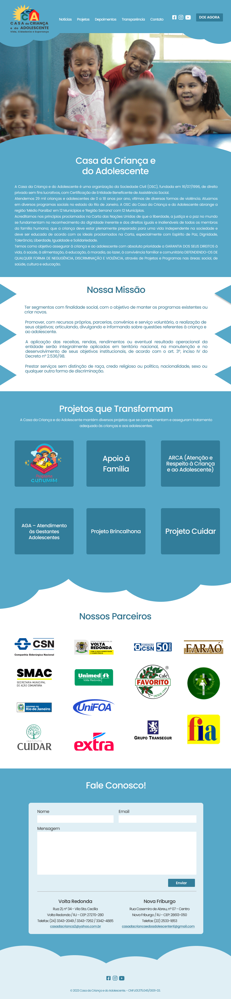

# Casa da Criança e do Adolescente - Site Institucional

Este repositório gerencia o desenvolvimento e manutenção do site institucional da Casa da Criança e do Adolescente, um projeto integrador conduzido pelo curso de Sistemas de Informação da instituição de ensino UniFOA - Centro Universitário de Volta Redonda.

## Participantes do Projeto:

- **Sistemas de Informação**: Desenvolvimento do site

## Objetivo Principal:

O projeto visa aprimorar a presença online da Casa da Criança e do Adolescente, fornecendo uma plataforma informativa e interativa. Busca-se divulgar os programas, projetos sociais e atividades da instituição de forma acessível, promovendo transparência e engajamento com a comunidade. Além disso, o site pretende facilitar o contato com a instituição, fornecendo informações relevantes, oportunidades de doação e atualizações sobre suas iniciativas.

## To Do:

- Refatorar código.
- Migrar notícias para um serviço de database.
- Atualizar e melhorar identidade visual do site.
- Criar rota no backend para autenticação de `ADMINS` antes da criação de novas notícias.

## Links

- **Site Institucional**: [Casa da Criança e do Adolescente](https://www.ccavr.org.br/)

## Identidade Visual

## Screenshot

