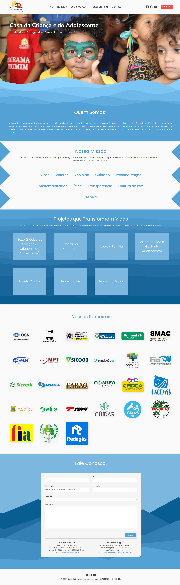

# Casa da Criança e do Adolescente - Site Institucional

Este repositório gerencia o desenvolvimento e manutenção do site institucional da Casa da Criança e do Adolescente, um projeto integrador conduzido pelo curso de Sistemas de Informação da instituição de ensino UniFOA - Centro Universitário de Volta Redonda.

## Participantes do Projeto:

- **Sistemas de Informação**: Desenvolvimento do site

## Objetivo Principal:

O projeto visa aprimorar a presença online da Casa da Criança e do Adolescente, fornecendo uma plataforma informativa e interativa. Busca-se divulgar os programas, projetos sociais e atividades da instituição de forma acessível, promovendo transparência e engajamento com a comunidade. Além disso, o site pretende facilitar o contato com a instituição, fornecendo informações relevantes, oportunidades de doação e atualizações sobre suas iniciativas.

## To Do:

- Refatorar código.
- Atualizar e melhorar identidade visual do site.
- Criar rota no backend para autenticação de `ADMINS` antes da criação, deleção e atualização de notícias.

## Ferramentas Utilizadas

- **React.js**: Biblioteca JavaScript para construção de interfaces de usuário.
- **Next.js**: Framework React para desenvolvimento de aplicativos web com renderização do lado do servidor (SSR) e geração de páginas estáticas.
- **TypeScript**: Linguagem de programação que adiciona tipagem estática ao JavaScript.
- **Prisma**: Ferramenta ORM para Node.js e TypeScript, simplificando o trabalho com bancos de dados.
- **Zod**: Biblioteca para validação de dados em TypeScript.
- **Zustand**: Biblioteca para gerenciamento de estado em aplicações React.
- **Nodemailer**: Biblioteca para enviar e-mails de forma fácil e eficiente no Node.js.
- **Vercel Blob**: Serviço de armazenamento de arquivos da Vercel, ideal para hospedar imagens e outros arquivos estáticos.
- **SASS**: Pré-processador CSS que permite o uso de variáveis, aninhamento e outras funcionalidades avançadas.
- **ESLint**: Ferramenta de linting para JavaScript e TypeScript, ajudando a manter um código consistente e livre de erros.
- **React Google reCAPTCHA**: Componente React para integrar o Google reCAPTCHA, aumentando a segurança dos formulários.

## Links

- **Site Institucional**: [Casa da Criança e do Adolescente](https://www.ccavr.org.br/)

## Identidade Visual

## Screenshot

